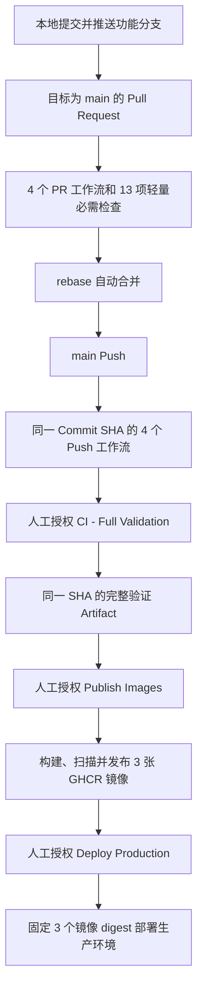

# GitHub Actions 工作流说明

## 1. 文档目标

本文说明仓库中每个 GitHub Actions 工作流的触发条件、执行步骤、作用、使用场景、失败含义和流程边界。

本文负责解释“GitHub 收到提交后会运行什么”以及“人工发布和部署会执行什么”。实际发布、部署和回滚操作仍以[发布与回滚手册](release-and-rollback.md)为准，不在本文重复维护生产操作决策。

工作流配置是执行事实的最终来源：

| 工作流 | 配置文件 |
| --- | --- |
| CI - Governance | [ci-governance.yml](../../.github/workflows/ci-governance.yml) |
| CI - Backend | [ci-backend.yml](../../.github/workflows/ci-backend.yml) |
| CI - Frontend | [ci-frontend.yml](../../.github/workflows/ci-frontend.yml) |
| CI - Full Validation | [ci-e2e.yml](../../.github/workflows/ci-e2e.yml) |
| Security | [security.yml](../../.github/workflows/security.yml) |
| Publish Images | [publish-images.yml](../../.github/workflows/publish-images.yml) |
| Deploy Production | [deploy-production.yml](../../.github/workflows/deploy-production.yml) |

## 2. 总体流程



流程坚持四项边界：

1. 功能分支 push 不运行整套检查；目标为 `main` 的 Pull Request 和 `main` push 触发轻量静态、契约、治理与安全检查，不运行应用测试或前端生产构建，不发布镜像，不接触生产服务器。
2. 完整验证只允许人工按需触发，不随 Push、Pull Request 或定时任务自动运行；它对输入 Commit SHA 执行 pytest、Vitest、production build 和 Chromium Playwright，并在全部成功后生成 30 天保留的 Artifact。
3. 镜像发布必须人工触发，并且只接受同时通过四个自动 Push 工作流和人工完整验证证据校验的完整 Commit SHA。
4. 生产部署必须再次人工触发，并固定三个已经验证的镜像 digest。

## 3. 触发条件总表

| 工作流 | Push | Pull Request | 定时 | 人工触发 |
| --- | --- | --- | --- | --- |
| CI - Governance | 仅 `main` | 仅目标为 `main` | 否 | 否 |
| CI - Backend | 仅 `main` | 仅目标为 `main` | 否 | 否 |
| CI - Frontend | 仅 `main` | 仅目标为 `main` | 否 | 否 |
| CI - Full Validation | 否 | 否 | 否 | 是 |
| Security | 仅 `main` | 仅目标为 `main` | 每周一次 | 否 |
| Publish Images | 否 | 否 | 否 | 是 |
| Deploy Production | 否 | 否 | 否 | 是 |

四个自动工作流统一限制为目标为 `main` 的 Pull Request 和 push 到 `main`。功能分支 push 不再重复运行整套检查；PR 在合并前运行轻量门禁，合并后的 `main` push 再为精确 Commit SHA 生成镜像发布所需的四项成功记录。当前未配置路径过滤，也不自动运行 Backend pytest、前端 Vitest、前端 production build 或 Playwright。

`CI - Full Validation` 只支持从 GitHub Actions 页面人工触发，必须从默认分支选择工作流并输入属于默认分支历史的完整 40 位 Commit SHA。普通开发和 Git 交付不自动运行它；需要发布镜像时，同一 SHA 的成功完整验证 Artifact 是 `Publish Images` 的前置证据。

`Security` 的定时表达式是 `23 3 * * 1`，即每周一 `03:23 UTC`。在中国标准时间下对应每周一 `11:23`。

`git push` 只上传已经提交的 Git 对象。本地未提交修改和未跟踪文件不会进入 GitHub，也不会被对应 Actions Run 检查。

### 3.1 远端仓库治理基线

截至 2026-08-24，GitHub 远端按单维护者基线配置：

- Dependabot vulnerability alerts、Secret Scanning、Push Protection 和 Private
  Vulnerability Reporting 已启用；Dependabot security updates 按人工依赖 PR 决策保持关闭。
- 2026-08-22 的 Medium/Low 治理已通过锁文件修复 `@babel/core`、`@babel/runtime`、
  `esbuild` 和 `send` 四条告警，推送后由 Dependabot 重扫自动关闭。React Router 告警
  `#4`、`#7` 与 `elliptic` 告警 `#5` 因当前没有受 Umi 支持的安全升级路径，已使用
  `tolerable_risk` 记录依赖链、不可达性证据、负责人和 2026-09-21 复核日期；这三条属于
  限时风险接受，不属于漏洞修复。完成时 GitHub Dependabot 为 0 Open、7 Closed。
- Actions 只允许 GitHub-owned Actions、仓库所有者 `jinmozhe` 下的 Actions，以及仓库现有
  工作流使用的 11 条明确第三方匹配规则；`sha_pinning_required=true`，所有 Action 必须固定
  完整 Commit SHA。
- active Ruleset `Protect main`（ID `21152538`）作用于默认分支，禁止删除和非快进更新，
  要求 Pull Request、会话解决和 13 个自动状态检查。
- Ruleset 审批数为 0，不要求第二维护者批准，但不保留个人、管理员或日常维护 bypass。
  `current_user_can_bypass=never`，维护者只能在必需检查满足后自行合并 Pull Request。
  紧急恢复如需临时调整 Ruleset，必须单独授权、保留审计记录并在恢复后立即撤销。
- 仓库启用 Auto-merge、rebase merge 和合并后自动删除功能分支。Auto-merge 只在 Ruleset 和必需检查满足后执行，不改变保护规则。
- `production` Environment（ID `20337656537`）只允许受保护分支，必要 Reviewer 为
  `jinmozhe`，`prevent_self_review=false`，当前 Secrets 和 Variables 均为 0。

单维护者基线没有独立审批职责分离，但 Pull Request 和自动检查仍是默认分支的强制门禁。
普通提交、分支推送和合并按用户文字分别授权。用户显式调用 `$git-sync` 时，该次调用覆盖当前任务的分支、提交、推送、PR、rebase 自动合并、分支清理和本地 `main` 同步；镜像发布和生产部署继续分别取得明确授权，并保留不可变发布和审计记录。

### 3.2 项目 Node.js 与 Action 运行时

工作流中 `actions/setup-node` 的 `node-version: "24"` 管理后续 `pnpm`、构建、测试和仓库脚本
使用的项目 Node.js。它不会改变其他 JavaScript Action 自身的运行时。

JavaScript Action 的执行版本由该 Action 固定提交中的 `action.yml` 或 `action.yaml` 的
`runs.using` 声明。仓库不能在调用方工作流中省略或改写这个值；只删除版本注释也不会改变
实际运行时。截至 2026-08-22，七个工作流直接引用的 JavaScript Action 均已升级到原生
`node24` 的正式版本并固定完整 Commit SHA，其余直接 Action 为 Composite 或 Docker Action。
仓库不设置 `ACTIONS_ALLOW_USE_UNSECURE_NODE_VERSION`，也不依赖 GitHub Runner 将旧
`node20` Action 兼容覆盖到 Node.js 24。

## 4. Pull Request 与 main Push 的执行顺序

GitHub 收到目标为 `main` 的 Pull Request 更新或 `main` 新提交后，会为对应 Commit SHA 创建四个相互独立的 Workflow Run：

1. `CI - Governance`
2. `CI - Backend`
3. `CI - Frontend`
4. `Security`

四个工作流通常并行排队和执行。它们之间没有 `workflow_run` 自动串联，因此一个工作流成功不会自动启动另一个工作流。

同一工作流内部可以通过 `needs` 建立 Job 依赖。例如 Backend 和 Frontend 先判断应用状态，再决定是否运行对应轻量质量检查。GitHub Runner 配额和依赖下载速度会影响完成先后顺序。

任意工作流失败时：

- 该 Commit SHA 的整体检查状态会出现失败。
- GitHub 可能按个人通知设置发送 Actions 失败邮件。
- 其他已经开始的工作流通常继续运行。
- `Publish Images` 会拒绝使用该 Commit SHA，因为它要求四个自动 Push 工作流和同 SHA 完整验证 Artifact 都有成功证据。
- 不会自动回退本地代码，也不会自动修改远程分支。

人工完整验证失败或 Artifact 缺失、过期时，该 Commit SHA 不能进入镜像发布。修复代码后应对新的 Commit SHA 重新运行；仅因 Artifact 过期时，可以在默认分支上对同一 SHA 重新人工触发完整验证。

## 5. CI - Governance

### 5.1 作用和使用场景

Governance 检查仓库结构、文本质量和架构边界，防止代码本身能编译，但仓库已经出现不完整应用、错误编码、生成缓存入库或跨模块非法依赖。

适用场景包括：

- 修改任何源码、配置或文档后验证文本卫生。
- 新增目录、应用入口、依赖或共享包后验证工作区状态。
- 调整 Backend 领域或 Frontend Feature 后验证模块边界。
- 修改治理脚本后运行正反例，确认门禁能够正确放行和拒绝。

### 5.2 执行步骤

| 步骤 | 作用 | 典型失败原因 |
| --- | --- | --- |
| Checkout repository | 检出目标提交 | Action 或 GitHub 基础设施异常 |
| Validate text assets | 检查 UTF-8、BOM、末尾换行和受控文件类型 | 乱码、UTF-8 BOM、缺少末尾换行 |
| Validate workspace state | 判断 Backend、Web、Admin 是 `empty`、`partial` 或 `ready` | 应用只有部分入口、脚本或配置 |
| Validate module boundaries | 检查跨应用和模块内部依赖 | 应用互相直接引用、领域越界导入 |
| Test governance guards | 用正反例验证治理脚本本身 | 门禁未拒绝反例、清理或退出码错误 |
| Install pnpm and Node.js | 安装固定 pnpm 11.17.0 和 Node.js 24 | 下载失败、缓存或运行环境异常 |
| Install locked dependencies | 按锁文件安装依赖 | 锁文件漂移、供应链策略拒绝依赖 |
| Lint Markdown | 运行全仓库 Markdown 格式检查 | 标题、列表、表格或链接格式违规 |

### 5.3 结果含义

成功表示仓库治理规则通过，不等于 Backend、Frontend 或真实业务流程已经通过。应用质量和端到端行为由其他工作流负责。

## 6. CI - Backend

### 6.1 作用和使用场景

Backend 工作流验证 FastAPI 应用的静态质量、模块边界、源码编译、应用导入和 OpenAPI 生成契约。它不启动 PostgreSQL 或 Redis，也不运行 Alembic 数据库验证和 pytest。

适用场景包括：

- 修改 Python 业务代码、配置、依赖或测试。
- 修改 SQLAlchemy Model 或 Alembic 迁移时检查源码、导入和文件边界；真实数据库验证需要用户明确授权后在本地执行。
- 修改 Router、Schema 或 OpenAPI 契约。
- 修改共享 API Client 的生成来源。

### 6.2 Backend state and boundaries

第一个 Job 运行工作区状态和模块边界检查，并输出 Backend 状态：

- `empty`：明确的空骨架，只报告状态，不宣称应用质量通过。
- `ready`：入口、依赖、测试和必要配置完整，继续运行 `backend-quality`。
- `partial`：部分实现状态，工作区门禁直接失败。

当前 Backend 为 `ready`，因此目标为 `main` 的 PR 和 `main` push 都会进入轻量质量检查。

### 6.3 Backend quality

Job 不启动测试服务容器，全部步骤应在没有 PostgreSQL、Redis 和测试数据库的条件下完成。

| 步骤 | 作用 |
| --- | --- |
| 安装 uv 和 CPython 3.14 | 建立固定 Python 运行环境 |
| `uv sync --locked` | 按 `uv.lock` 安装精确依赖，拒绝锁文件漂移 |
| Python 版本断言 | 确认实际运行 CPython 3.14 |
| Ruff | 检查 Python 代码质量和导入顺序 |
| Ruff format | 检查格式，无自动改写 |
| Mypy | 运行严格静态类型检查 |
| Import boundaries | 检查 Backend 模块依赖规则 |
| Compile Python sources | 编译应用、迁移和脚本源码 |
| Import application | 导入 FastAPI 应用并生成内存 OpenAPI |
| Export OpenAPI contract | 从 Backend 重新生成根 `openapi.json` |
| Regenerate API Client | 从 OpenAPI 重新生成 TypeScript Client |
| Reject generated contract drift | 发现生成结果与仓库不一致时失败 |

### 6.4 Pull Request 专属检查

`OpenAPI breaking changes` Job 只在 Pull Request 运行。它比较 PR 与目标分支的 `openapi.json`，使用 `oasdiff` 拒绝未处理的破坏性接口变化。

普通 push 不运行该 Job，因为 push 事件没有 PR 的目标分支上下文。

## 7. CI - Frontend

### 7.1 作用和使用场景

Frontend 工作流分别验证 Web 和 Admin 两个独立应用，只覆盖 ESLint 与 TypeScript 类型检查。单元或组件测试、生产构建和浏览器验证不由 Push 或 Pull Request 自动执行。

适用场景包括：

- 修改 Next.js Web 应用。
- 修改 Umi Max、React、Ant Design Admin 应用。
- 修改共享前端包或根依赖。
- OpenAPI 变化后验证两个消费者仍能通过类型检查。

### 7.2 Frontend state and boundaries

第一个 Job 检查工作区状态和模块边界，分别输出 `web` 与 `admin` 状态。`ready` 应用进入对应质量 Job，`partial` 状态导致门禁失败。

Web 和 Admin 当前均为 `ready`，两个质量 Job 可以并行执行。

### 7.3 Web quality

1. 安装固定 pnpm 11.17.0 和 Node.js 24。
2. 使用 `pnpm install --frozen-lockfile` 安装锁定依赖。
3. 运行 Web ESLint。
4. 运行 Web TypeScript 类型检查。

### 7.4 Admin quality

1. 安装固定 pnpm 11.17.0 和 Node.js 24。
2. 使用 `pnpm install --frozen-lockfile` 安装锁定依赖。
3. 运行 Admin ESLint。
4. 运行 Admin TypeScript 类型检查。

### 7.5 结果含义

成功只表示两个前端应用通过各自的 ESLint 和 TypeScript 类型检查，不表示 Vitest、production build 或浏览器流程通过。只有用户明确授权时才在本地运行对应重型命令，线上完整验证也由用户人工触发。

## 8. CI - Full Validation

### 8.1 作用和使用场景

完整验证只支持 `workflow_dispatch` 人工触发。操作人员必须从默认分支启动工作流并输入待验证的完整 Commit SHA；工作流会确认 SHA 属于默认分支历史，然后在 Ubuntu Runner 中执行 Backend pytest、Admin/Web Vitest、两端 production build 和 Chromium 跨栈 E2E。

完整验证环境同时允许 `127.0.0.1` 与 `localhost` 两组 Web/Admin 测试 Origin。真实服务和 Playwright 使用 `127.0.0.1`，Backend 既有 API 测试夹具使用 `localhost`；两组仅用于隔离 Runner 的本机回环地址，不能扩展为通配 Origin。

受控启动器等待 Web 服务返回 2xx，并且只在 Admin `/umi.js` 返回 JavaScript Content-Type 后放行 Playwright，避免 Umi 首次编译期间的 2xx HTML 回退页被误判为应用就绪。

它主要发现单元测试难以覆盖的问题：

- Backend 与数据库或 Redis 的真实连接问题。
- Cookie、CSRF、跨应用认证和同域代理问题。
- OpenAPI Client 与真实 HTTP 响应不一致。
- 页面路由、表单、权限导航和浏览器运行错误。
- 多个应用分别构建成功，但组合运行失败。

本地重型命令和线上完整验证都只在用户明确授权时运行。需要排除 Windows、本机缓存或本地服务差异，或准备镜像发布证据时，可以由用户人工触发该工作流获得干净 Ubuntu 环境的结果。它不参与 Pull Request 或 Push 门禁，也不会自动触发镜像发布；成功 Artifact 只作为后续独立授权的 `Publish Images` 输入证据。

### 8.2 执行步骤

1. 校验输入 SHA 格式、工作流分支、检出结果和默认分支祖先关系。
2. 启动 PostgreSQL 18.4 和 Redis 8.10.0 服务容器。
3. 使用固定 uv `0.11.32` 和标准 CPython 3.14 安装 Backend 锁定依赖。
4. 升级隔离测试数据库并运行包含 90% 覆盖率门禁的 Backend pytest。
5. 准备权限、注册设置和初始管理员，在 Runner 后台启动 Uvicorn，并轮询 `/health/live`。
6. 安装固定 pnpm 11.17.0、Node.js 24 和根锁文件依赖。
7. 运行 Admin 与 Web Vitest 及各自 80% 覆盖率门禁。
8. 执行 Admin 与 Web production build。
9. 安装 Chromium 及其系统依赖并运行 `pnpm test:e2e`。
10. 写入 Commit SHA、Workflow Run ID 和验证集合，上传 `full-validation-<完整 SHA>` Artifact，保留 30 天。

### 8.3 资源特征

该工作流会下载浏览器、启动数据库和 Redis，并运行三端重型测试与两个前端构建，耗时和资源占用较高，因此只能在用户明确授权后人工触发。任一步失败都不会上传成功证据；Artifact 过期后必须重新运行完整验证，不能通过修改输入或文本说明绕过。

## 9. Security

### 9.1 作用和使用场景

Security 工作流覆盖密钥泄露、依赖漏洞、依赖变更和源码安全问题。它在目标为 `main` 的 Pull Request、`main` push 和每周定时任务中运行，使没有新提交时出现的最新漏洞公告也能被发现。

### 9.2 Source state

运行工作区完整性检查，避免在应用处于不完整状态时把安全检查结果误表述为完整应用已经通过安全验证。

### 9.3 Gitleaks Secret scan

Gitleaks 使用完整 Git 历史检查密码、API Key、Token、私钥和其他高风险秘密。

适用场景：

- 开发者误提交真实 `.env`。
- 测试代码中写入真实云服务或支付密钥。
- 当前文件已删除密钥，但历史提交仍保留原文。

发现真实秘密后，必须先吊销或轮换对应凭据，再处理 Git 历史和扫描结果。只删除当前文件不能消除已经泄露的凭据风险。

### 9.4 Dependency review

该 Job 只在 Pull Request 运行，比较基础分支和 PR 之间的依赖变化，并拒绝新引入的高危依赖。

它回答的问题是“这次 PR 新增或升级的依赖带来了什么风险”，普通 push 和定时任务没有对应的 PR 差异，因此跳过。

### 9.5 Trivy Dependency vulnerability scan

Trivy 以文件系统模式扫描依赖清单和锁文件，检查 Python、Node.js 等生态中已经公开的已知漏洞。

当前门禁：

- 只把 `HIGH` 和 `CRITICAL` 作为阻断等级。
- 发现阻断漏洞时退出码为 1。
- 使用 `ignore-unfixed: true` 忽略尚无可用修复版本的漏洞。

适用场景包括新披露的 CVE/GHSA、锁文件中仍固定旧版本以及间接依赖带来的漏洞。

### 9.6 pnpm audit

`pnpm audit` 专门检查 pnpm/npm 生态的已知安全公告。当前使用 npm Registry，并通过 `--audit-level high` 阻断高危和严重漏洞。

它与 Trivy 的 Node.js 检查存在部分覆盖，但解析方式和数据来源链路不完全相同。双重检查用于降低单一工具遗漏风险。

### 9.7 Semgrep CE SAST

Semgrep 检查仓库自己编写的 Python、JavaScript、TypeScript、Shell、YAML 和其他受支持源码或配置，覆盖命令注入、危险 API、不安全数据流和 CI 配置风险。

当前配置：

```text
semgrep scan --config p/default --error --strict --metrics off
```

参数含义：

- `p/default`：使用 Semgrep Registry 的默认社区规则集。
- `--error`：发现规则命中时返回失败退出码。
- `--strict`：规则、解析警告和内部错误同样失败关闭。
- `--metrics off`：关闭使用指标上报。

CI 固定安装 Semgrep CE `1.173.0`，不配置 Semgrep Token，不创建云端项目，也不上传源码或扫描结果。

### 9.8 Security 失败如何判断

| 失败 Job | 优先检查 |
| --- | --- |
| Source state | 应用是否进入 `partial`，入口、脚本和测试是否完整 |
| Secret scan | 命中内容是否是真实密钥，是否需要立即轮换 |
| Dependency review | PR 是否新引入高危依赖 |
| Dependency vulnerability scan | Trivy 报告的包、版本、严重度和可修复版本 |
| Node dependency audit | pnpm 报告的直接或间接依赖链 |
| Semgrep CE SAST | 规则 ID、文件、行号、数据流和修复建议 |

依赖安装还执行仓库级供应链策略：uv 和 pnpm 对新发布版本设置七天冷却期，pnpm 拒绝奇异传递依赖和包信任等级降级。历史信任问题只允许精确包版本例外；新依赖、升级解析或现有锁文件违反策略时会在安装阶段失败。

扫描器发现问题和扫描器自身故障都可能使 Job 失败。判断时先看具体 Job 和第一条有效错误，不能只根据 `Security failed` 邮件标题推断原因。

## 10. Pull Request 流程差异

Pull Request 会运行同样的四个自动工作流，并额外启用两项差异检查：

1. Backend 的 `OpenAPI breaking changes` 比较目标分支与 PR 契约。
2. Security 的 `Dependency review` 检查 PR 新增或改变的依赖。

Pull Request 检查用于合并前评审。`main` push 检查用于验证已经进入默认分支的精确 Commit SHA。镜像发布要求的是同一 Commit SHA 的成功 `push` Run，PR Run 不能替代。

## 11. Publish Images

### 11.1 作用和使用场景

`Publish Images` 把一个已经通过四个自动门禁和同 SHA 人工完整验证的 Commit SHA 构建为 Backend、Web 和 Admin 三张不可变 GHCR 镜像。

典型使用场景：

- 准备正式部署某个已经审核的 `main` 提交。
- 为派生项目或测试环境生成可追溯镜像。
- 为后续回滚保留经过扫描和证明的镜像版本。

该工作流只支持 `workflow_dispatch` 人工触发。执行前必须取得独立的镜像发布授权，并输入完整 40 位小写 Commit SHA。

### 11.2 Validate immutable input

发布前验证包括：

1. Commit SHA 必须匹配 40 位小写十六进制格式。
2. 检出的 `HEAD` 必须与输入 SHA 完全一致。
3. 目标提交必须属于仓库默认分支历史。
4. 同一 SHA 必须存在以下四个成功、已完成的 Push Run：
   - `CI - Governance`
   - `CI - Backend`
   - `CI - Frontend`
   - `Security`
5. GitHub Actions 必须存在名称为 `full-validation-<完整 SHA>` 且未过期的 Artifact。
6. Artifact 所属 Run 必须由默认分支通过 `workflow_dispatch` 启动，工作流路径为 `.github/workflows/ci-e2e.yml`，结论为成功。
7. Artifact 内容中的 Commit SHA、Workflow Run ID、pytest、Vitest、production build、Chromium Playwright、PostgreSQL 和 Redis 字段必须全部匹配。
8. Backend、Web 和 Admin 状态必须全部为 `ready`。
9. 模块边界必须再次通过。

任何一项缺少时，工作流在构建镜像前停止。四个 Push Run 继续只代表轻量门禁和安全检查，重型验证由同 SHA Artifact 证明；发布矩阵中的 Docker build 只负责生成制品，不能替代验证证据。

### 11.3 Publish matrix

验证通过后，矩阵并行处理三个应用：

| 矩阵项 | Dockerfile | GHCR 镜像名 |
| --- | --- | --- |
| Backend | `apps/backend/Dockerfile` | `pinjie-fullstack-backend` |
| Web | `apps/web/Dockerfile` | `pinjie-fullstack-web` |
| Admin | `apps/admin/Dockerfile` | `pinjie-fullstack-admin` |

每个矩阵任务执行：

1. 检出目标提交并再次核对 SHA。
2. 设置 Docker Buildx。
3. 使用当前 GitHub Actor 和 `GITHUB_TOKEN` 登录 GHCR。
4. 构建并按内容 digest 推送候选镜像。
5. 生成最大级别构建来源证明和 SBOM。
6. 使用 Trivy 扫描已经推送的精确镜像 digest。
7. 高危或严重且已有修复的漏洞使发布失败。
8. 为镜像写入并推送 GitHub build provenance attestation。
9. 上传经过验证的 digest 证据 Artifact，保留 7 天。

### 11.4 Finalize

三个矩阵任务全部成功后，最终 Job：

1. 下载三份经过验证的 digest 证据。
2. 检查 `sha-<完整 Commit SHA>` 目标标签是否存在冲突。
3. 标签不存在时，从精确 digest 创建不可变 SHA 标签。
4. 标签已经指向同一 digest 时允许验证通过。
5. 标签指向不同 digest 时立即失败，禁止覆盖。
6. 在 Workflow Summary 输出三个最终镜像引用。

工作流不会创建 `latest` 标签。GHCR 的三个镜像仓库之间没有事务，最终标签创建期间可能短暂部分可见；只有整个 `Publish Images` Run 成功后，才能进入部署授权。

### 11.5 权限

验证 Job 只读取 Actions 和仓库内容。构建 Job 按需获得 `packages: write`、`attestations: write` 和 `id-token: write`。权限只在需要的 Job 内提升。

## 12. Deploy Production

### 12.1 作用和使用场景

`Deploy Production` 将已经发布并验证的三个镜像 digest 部署到生产服务器。它不重新构建源码，也不自动选择最新镜像。

典型使用场景：

- 将一组已经发布的 Backend、Web 和 Admin 镜像上线。
- 使用上一组已验证 digest 执行应用回滚。

该工作流只支持 `workflow_dispatch` 人工触发。真实部署和回滚分别需要独立授权。

### 12.2 人工输入

| 输入 | 要求 |
| --- | --- |
| `commit_sha` | 三张镜像共同来源的完整 40 位小写 Commit SHA |
| `backend_digest` | `sha256:` 加 64 位小写十六进制 |
| `web_digest` | `sha256:` 加 64 位小写十六进制 |
| `admin_digest` | `sha256:` 加 64 位小写十六进制 |

工作流绑定 GitHub `production` Environment。远端仓库应在该 Environment 配置审批者和分支保护；这些设置存在于 GitHub 仓库中，不能只通过 YAML 证明已经生效。

### 12.3 并发和权限

- 并发组固定为 `production`，同一时间只允许一个生产部署或回滚流程运行。
- `cancel-in-progress: false`，后启动的流程不会强制取消正在执行的部署。
- 工作流只申请 `contents: read` 和 `packages: read`。

### 12.4 部署前验证

1. 检出输入 Commit SHA，并要求它属于默认分支历史。
2. 计算目标提交中 `compose.prod.yml` 的 SHA-256。
3. 要求 `PRODUCTION_DEPLOYMENT_ENABLED` 为 `true`。
4. 要求 `DEPLOY_PATH` 是非空绝对路径。
5. 验证三个 digest 的格式。
6. 登录 GHCR。
7. 分别解析三个 `sha-<commit>` 标签，确认实际 manifest digest 与人工输入完全一致。

这组验证保证操作人员输入的 Commit SHA、发布标签和镜像内容指向同一版本。

### 12.5 远程部署

工作流通过固定版本的 SSH Action 连接生产服务器，并只传递部署所需变量。

远程脚本依次执行：

1. 使用 `set -eu` 开启失败关闭。
2. 进入 `DEPLOY_PATH`。
3. 确认 `apps/backend/.env` 和根 `.env` 存在。
4. 计算服务器 `compose.prod.yml` 哈希，并与目标提交哈希比较。
5. 以权限 `077` 创建临时镜像变量文件。
6. 从现有根 `.env` 保留 PostgreSQL 初始化变量。
7. 写入三张固定 digest 镜像引用。
8. 使用 `docker compose config --quiet` 验证配置。
9. 拉取三个固定 digest。
10. 执行 `docker compose up -d --remove-orphans --wait --wait-timeout 120`。
11. 查询 Compose 服务状态。
12. 逐个读取运行容器的镜像引用，并与批准输入比较。
13. 全部一致后，用临时文件替换根 `.env`。
14. 写入 `.deployment-version`，保存 Commit SHA 和 Compose 哈希。

最后一步在 GitHub Workflow Summary 记录 Commit SHA、Compose 哈希和三个镜像 digest。

### 12.6 成功含义

Workflow 显示成功，表示远程命令、Compose 等待和镜像引用核对均已完成。正式生产交付仍应按发布手册继续验证健康探针、关键业务冒烟、数据库 Revision、日志和观察窗口。

## 13. 完整使用场景

### 13.1 `$git-sync` 日常交付

```text
本地修改
-> 本地验证
-> 显式调用 `$git-sync`
-> 创建或使用 `codex/*` 功能分支
-> 精确暂存并提交
-> 推送功能分支，不触发整套检查
-> 创建或更新目标为 `main` 的 Pull Request
-> 设置 rebase Auto-merge
-> 4 个 PR 工作流并行运行
-> 额外执行 OpenAPI breaking changes 和 Dependency review
-> 13 项必需检查满足后自动合并并删除远端分支
-> 合并提交再次触发 4 个 Push 工作流
-> 本地 fast-forward 同步 `main` 并删除已合并分支
```

`main` 不允许日常直接推送。检查失败、取消、缺失或 PR 无法合并时，`$git-sync` 停止并保留 PR 和分支，报告具体失败检查。它不会关闭工作流、降低门槛或使用 Ruleset bypass。

### 13.2 Pull Request 评审

Pull Request 是所有日常变更的唯一默认分支入口。检查失败时先查看对应 Job 日志并在原开发分支修复；禁止通过临时关闭工作流、降低严重级别或恢复永久 bypass 完成合并。

### 13.3 正式镜像发布

```text
选择 main 上的完整 Commit SHA
-> 确认该 SHA 的 4 个 Push 工作流全部成功
-> 取得重型验证授权并人工触发 CI - Full Validation
-> 确认同一 SHA 的完整验证 Run 和 Artifact 成功
-> 取得镜像发布授权
-> 人工触发 Publish Images
-> 等待 validate、3 个 publish 矩阵和 finalize 全部成功
-> 保存 Workflow Summary 中的三个 digest
```

### 13.4 生产部署

```text
取得生产部署授权
-> 准备 Commit SHA 和三个 digest
-> 核对 production Environment 审批和变量
-> 人工触发 Deploy Production
-> 完成 Environment 审批
-> 等待远程部署和镜像核对
-> 执行部署后健康、业务、日志和数据验证
-> 记录生产追溯信息
```

### 13.5 回滚

```text
确认达到回滚条件
-> 选择上一组已验证 digest
-> 核对数据库兼容性和恢复点
-> 取得回滚授权
-> 使用 Deploy Production 输入旧 Commit SHA 和旧 digest
-> 完成部署后验证和事故记录
```

应用回滚不重新构建旧代码。数据库降级或恢复属于独立高风险操作，需要专项授权。

## 14. 常见失败定位

| 现象 | 查看位置 | 常见原因 |
| --- | --- | --- |
| 邮件只写 Workflow failed | GitHub Actions 对应 Run 的红色 Job | 邮件标题不包含根因 |
| Governance 失败 | 第一条失败的治理步骤 | 文本编码、Markdown、结构或边界问题 |
| Backend quality 失败 | PostgreSQL、Redis 或具体质量步骤 | 锁文件、类型、迁移、测试、覆盖率、契约漂移 |
| Frontend quality 失败 | Web 或 Admin Job | lint、类型、测试、构建、生成 Client 漂移 |
| Full Validation 失败 | 第一条失败的 pytest、Vitest、build、Backend 启动或 Playwright 步骤 | 迁移、测试、覆盖率、构建、服务启动、浏览器流程或跨栈契约问题 |
| Security 失败 | 具体扫描 Job | 密钥、依赖漏洞、源码风险或扫描器运行错误 |
| Publish validate 失败 | Validate immutable input | SHA 格式、默认分支、四个 Push Run、完整验证 Artifact 或应用状态不满足 |
| Publish matrix 失败 | 对应应用矩阵 | 镜像构建、容器漏洞、证明或 GHCR 权限问题 |
| Publish finalize 失败 | Publish verified immutable tags | digest 证据缺失或不可变标签冲突 |
| Deploy 验证失败 | Validate 或 Verify 步骤 | 输入格式、环境开关、路径、标签与 digest 不一致 |
| 远程部署失败 | Deploy approved digests | SSH、Compose 哈希、环境文件、拉取、健康或镜像核对失败 |

排查原则：

1. 先确认失败的 Workflow 和 Job。
2. 找到第一条真正失败的命令，后续错误可能只是连锁结果。
3. 区分代码问题、扫描发现、依赖服务故障和 GitHub Runner 故障。
4. 在本地复现适用检查，修复后创建新提交。
5. 禁止通过 `continue-on-error`、删除检查或扩大权限制造假成功。

## 15. 必须与可替换边界

GitHub 平台不强制仓库使用这些具体工具。当前项目规则和发布工作流要求以下能力必须有成功证据：

- 仓库治理和模块边界检查。
- Backend 和 Frontend 质量检查。
- 同一 Commit SHA 的 pytest、Vitest、production build 和 Chromium Playwright 完整验证 Artifact。
- 密钥、依赖漏洞和源码静态安全检查。
- 镜像漏洞扫描、SBOM 和构建来源证明。
- 固定 Commit SHA 和镜像 digest 的生产追溯。

具体工具未来可以通过已确认计划替换，但不能直接删除能力或静默跳过。任何门禁调整都应同步工作流配置、安全策略、本文、发布手册和相关计划。

本地重型验证继续按风险和用户授权执行，不形成镜像发布证据。GitHub 完整验证保持人工触发，不进入自动 CI；需要发布镜像时，其同 SHA 成功 Artifact 属于发布门禁，但不会自动授权或触发发布。

## 16. 操作检查清单

### Push 前

- [ ] 本地修改已经完成适用验证。
- [ ] `git status` 中没有准备遗漏的文件。
- [ ] 提交不包含真实 `.env`、Token、密码或私钥。
- [ ] 生成契约和锁文件不存在未解释漂移。

### Pull Request 后

- [ ] 四个 PR 工作流均对应预期功能分支 Commit SHA。
- [ ] Governance、Backend、Frontend 和 Security 全部成功。
- [ ] 没有把 `skipped` 误判成应用质量通过。
- [ ] 失败时已定位具体 Job 和第一条有效错误。

### 合并后

- [ ] PR 以 rebase 方式合并，远端功能分支已经删除。
- [ ] 本地 `main` 已通过 fast-forward 与 `origin/main` 同步。
- [ ] 四个 `main` Push 工作流均对应合并后的精确 Commit SHA。

### 发布镜像前

- [ ] 已取得独立镜像发布授权。
- [ ] 使用完整 40 位 Commit SHA。
- [ ] 四个 Push 工作流都有同一 SHA 的成功记录。
- [ ] 已人工完成同一 SHA 的完整验证，Artifact 未过期且 Run 成功。
- [ ] 三个应用状态均为 `ready`。

### 部署生产前

- [ ] 已取得独立生产部署授权。
- [ ] 三个 digest 来自同一次成功的 Publish Images Run。
- [ ] `production` Environment 审批和变量已经核验。
- [ ] 数据库迁移、备份、恢复和回滚边界已经确认。
- [ ] 部署后验证、观察窗口和停止条件已经安排。
